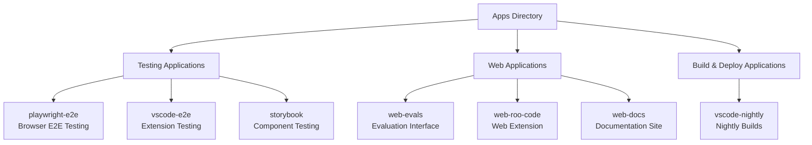
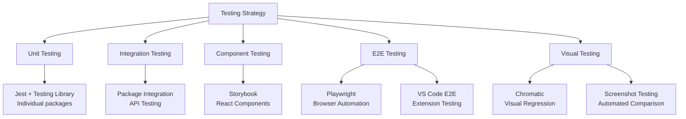

# Kilo Code Apps Directory & Testing/Tooling Analysis

## Executive Summary

The Kilo Code monorepo contains a sophisticated apps directory with 7 specialized applications supporting development, testing, documentation, and deployment workflows. This analysis examines each app's purpose, the comprehensive testing infrastructure, development tooling ecosystem, and monorepo integration patterns that demonstrate enterprise-grade development practices.

## Apps Directory Structure Overview



## Individual App Analysis

### Testing Applications

#### [`apps/playwright-e2e/`](kilocode/apps/playwright-e2e/) - Browser End-to-End Testing
- **Purpose**: Cross-browser automated testing for web components and user workflows
- **Framework**: Playwright 1.53.1 with TypeScript
- **Key Features**:
  - Cross-browser testing (Chromium, Firefox, WebKit)
  - Visual regression testing capabilities
  - Parallel test execution with CI optimization
  - Docker containerization support for consistent environments
  - Custom test utilities and helpers
- **Configuration**: [`playwright.config.ts`](kilocode/apps/playwright-e2e/playwright.config.ts:1) with environment-specific settings
- **CI Integration**: Automated execution with retries and video recording on failures
- **Scripts**:
  - `playwright`: Standard test execution with environment variables
  - `playwright:docker`: Containerized testing for CI/CD
  - `playwright:verbose`: Debug mode with detailed logging

#### [`apps/vscode-e2e/`](kilocode/apps/vscode-e2e/) - VS Code Extension Testing
- **Purpose**: End-to-end testing specific to VS Code extension functionality
- **Framework**: VS Code Test Electron with Mocha
- **Key Features**:
  - Extension activation and lifecycle testing
  - Command execution validation
  - UI integration testing within VS Code environment
  - Automated extension marketplace scenarios
- **Dependencies**: `@vscode/test-electron`, `@vscode/test-cli`, custom test utilities
- **Scripts**:
  - `test:ci`: Full CI pipeline with bundle and webview build
  - `test:run`: Local test execution with TypeScript compilation
- **Integration**: Requires main extension bundle and webview builds

#### [`apps/storybook/`](kilocode/apps/storybook/) - Component Development & Testing
- **Purpose**: Isolated component development, documentation, and visual testing
- **Framework**: Storybook 9.x with React and Vite
- **Key Features**:
  - React component isolation and interactive development
  - Visual regression testing with Chromatic integration
  - Accessibility testing and validation
  - Design system documentation and validation
  - VS Code theme integration and testing
- **Configuration**: [`main.ts`](kilocode/apps/storybook/.storybook/main.ts:1) with sophisticated alias management
- **Stories**: Comprehensive coverage of UI components (Badge, Button, ChatView, etc.)
- **Scripts**:
  - `storybook`: Development server on port 6006
  - `build-storybook`: Production build with webpack stats
  - `chromatic`: Visual regression testing with Chromatic
  - `generate-theme-styles`: VS Code theme integration

### Web Applications

#### [`apps/web-evals/`](kilocode/apps/web-evals/) - Evaluation Interface
- **Purpose**: Web-based evaluation interface for AI model testing and performance monitoring
- **Framework**: Next.js 15.2.5 with TypeScript and React
- **Key Features**:
  - Interactive evaluation dashboard and metrics visualization
  - Real-time evaluation monitoring with Server-Sent Events
  - Performance metrics analysis and reporting
  - Integration with evaluation packages from monorepo
  - Redis-based session management and data persistence
- **Architecture**: Modern React with TanStack Query, Radix UI components
- **API Routes**: RESTful endpoints for runs, health checks, and streaming
- **Scripts**:
  - `dev`: Development server with service dependency checks
  - `build`: Production optimization
  - Service validation via `scripts/check-services.sh`

#### [`apps/web-roo-code/`](kilocode/apps/web-roo-code/) - Web Extension
- **Purpose**: Browser-based version of the Kilo Code extension
- **Framework**: Next.js 15.2.5 with React and TypeScript
- **Key Features**:
  - Cross-platform browser compatibility
  - Progressive Web App capabilities
  - Enterprise and evaluation page integration
  - Production deployment optimization with redirects
  - Shared core logic with VS Code extension
- **UI Libraries**: Radix UI, Framer Motion, Embla Carousel, Recharts
- **Analytics**: PostHog integration for user tracking
- **Configuration**: Production redirects for www/HTTPS and cloud waitlist

#### [`apps/web-docs/`](kilocode/apps/web-docs/) - Documentation Site
- **Purpose**: Centralized documentation website and developer portal
- **Status**: Placeholder directory with minimal content
- **Planned Features**: 
  - API reference generation
  - Developer guides and tutorials
  - Searchable documentation
  - Integration examples

### Build & Deploy Applications

#### [`apps/vscode-nightly/`](kilocode/apps/vscode-nightly/) - Nightly Builds
- **Purpose**: Automated nightly build configuration and distribution
- **Framework**: Custom build tooling with esbuild
- **Key Features**:
  - Automated nightly release generation
  - Pre-release feature testing and validation
  - Beta user feedback collection pipeline
  - Continuous deployment automation
- **Scripts**:
  - `bundle:nightly`: Custom build process via esbuild.mjs
  - `vsix:nightly`: VSIX package generation for distribution
- **Integration**: Leverages shared build configuration from `@roo-code/build`

## Testing Infrastructure Analysis

### Multi-Layered Testing Strategy



### Testing Frameworks & Tools

1. **Playwright** (`@playwright/test` 1.53.1)
   - Cross-browser end-to-end testing
   - Visual regression detection
   - Parallel execution with CI optimization
   - Docker support for consistent environments

2. **Jest + Testing Library**
   - Unit and integration testing across packages
   - React component testing utilities
   - Comprehensive assertion library

3. **Storybook Test Runner**
   - Automated component testing
   - Accessibility validation
   - Visual regression with Chromatic

4. **VS Code Extension Test Framework**
   - Extension-specific testing with `@vscode/test-electron`
   - Mocha-based test execution
   - VS Code environment simulation

5. **Chromatic Integration**
   - Visual regression testing for UI components
   - Design system validation
   - Automated screenshot comparison

### Test Organization Patterns

- **Isolation**: Each app maintains its own test configuration and execution
- **Shared Utilities**: Common testing utilities via workspace packages
- **Environment-Specific**: Separate configurations for local vs CI execution
- **Parallel Execution**: Optimized for CI/CD with appropriate worker allocation
- **Dependency Management**: Proper test execution ordering via Turbo

## Development Tooling Ecosystem

### Workflow Support Applications

1. **Storybook** - Component Development
   - Isolated component development environment
   - Interactive documentation and testing
   - Design system validation and consistency
   - VS Code theme integration for authentic styling

2. **Web Evals** - Performance Monitoring
   - Real-time evaluation dashboards
   - Performance metrics visualization
   - Model comparison and analysis tools
   - Integration with evaluation framework

3. **Web Docs** - Documentation Portal
   - Centralized documentation hub (planned)
   - API reference generation
   - Developer onboarding resources

4. **Nightly Builds** - Continuous Testing
   - Automated pre-release generation
   - Beta user feedback collection
   - Feature validation pipeline

### Build & Development Tools

- **Turbo**: Monorepo orchestration and intelligent caching
- **TypeScript**: Type safety across all applications
- **ESLint/Prettier**: Code quality and formatting consistency
- **Vite/Next.js**: Modern build tooling for web applications
- **esbuild**: High-performance bundling for extension builds

### Quality Assurance Tools

- **Multi-framework Testing**: Comprehensive coverage across different testing needs
- **Visual Regression**: Automated UI change detection
- **Accessibility Testing**: Built-in a11y validation via Storybook
- **Performance Monitoring**: Real-time metrics and evaluation tracking
- **Type Safety**: Compile-time error detection across all applications

## Monorepo Integration Patterns

### Shared Dependencies Architecture

```mermaid
graph TD
    A[Apps] --> B[Shared Packages]
    
    B --> C[@roo-code/types<br/>Common TypeScript Definitions]
    B --> D[@roo-code/evals<br/>Evaluation Framework]
    B --> E[@roo-code/config-eslint<br/>Linting Configuration]
    B --> F[@roo-code/config-typescript<br/>TypeScript Settings]
    B --> G[@roo-code/build<br/>Build Utilities]
    
    A --> H[playwright-e2e]
    A --> I[storybook]
    A --> J[web-evals]
    A --> K[web-roo-code]
    A --> L[vscode-e2e]
    A --> M[vscode-nightly]
    A --> N[web-docs]
```

### Build Orchestration via Turbo

The [`turbo.json`](kilocode/turbo.json:1) configuration defines sophisticated build pipelines:

- **Parallel Execution**: Independent app builds run concurrently
- **Dependency Management**: Proper build ordering with dependency graphs
- **Intelligent Caching**: Incremental builds and test execution
- **Pipeline Optimization**: Efficient CI/CD workflows with cache optimization

Key Turbo Tasks:
- `build`: Optimized builds with proper input/output tracking
- `test`: Test execution with dependency on type builds
- `storybook`: Development server with persistence
- `chromatic`: Visual testing with Storybook build dependency
- `playwright`: E2E testing without caching for reliability

### Development Workflows

#### Local Development
```bash
pnpm install          # Install all dependencies
pnpm dev              # Start all development servers
pnpm test             # Run comprehensive test suites
pnpm lint             # Code quality checks
pnpm build            # Production builds
```

#### CI/CD Integration
- **GitHub Workflows**: Automated testing and deployment
- **Changeset Management**: Version bump automation
- **Marketplace Publishing**: Automated extension releases
- **Quality Gates**: Tests must pass before deployment

### Workspace Configuration

The root [`package.json`](kilocode/package.json:1) demonstrates enterprise-grade monorepo management:

- **Package Manager**: pnpm 10.8.1 with strict engine requirements
- **Turbo Integration**: Build orchestration with intelligent caching
- **Development Scripts**: Comprehensive workflow automation
- **Quality Tools**: Husky, lint-staged, Prettier integration
- **Security**: Package overrides for vulnerability management

## Key Insights & Best Practices

### Testing Excellence
- **Comprehensive Coverage**: Unit, integration, component, E2E, and visual testing
- **Framework Specialization**: Right tool for each testing need
- **CI/CD Integration**: Automated quality gates and deployment
- **Performance Optimization**: Parallel execution and intelligent caching

### Development Experience
- **Hot Reloading**: Fast development cycles across all applications
- **Type Safety**: Full TypeScript coverage with shared type definitions  
- **Component Development**: Isolated development via Storybook
- **Documentation**: Comprehensive guides and API references

### Deployment Strategy
- **Multi-target Deployment**: VS Code extension, web apps, documentation
- **Environment Management**: Development, staging, production configurations
- **Automated Releases**: Changeset-driven version management
- **Performance Monitoring**: Real-time evaluation and metrics tracking

### Architectural Strengths
- **Modular Design**: Clear separation of concerns across applications
- **Shared Infrastructure**: Consistent tooling and configurations
- **Scalable Testing**: Multi-layered approach supporting growth
- **Enterprise Grade**: Production-ready with monitoring and analytics

## Extending the Testing & Tooling Infrastructure

### Guidelines for New Applications

1. **Testing Strategy**
   - Include appropriate test frameworks for your application type
   - Follow existing patterns for test organization and execution
   - Integrate with Turbo build pipeline for optimization
   - Add CI/CD integration for automated quality gates

2. **Development Tooling**
   - Leverage shared configurations (ESLint, TypeScript, etc.)
   - Use workspace packages for common functionality
   - Follow naming conventions (`@roo-code/app-name`)
   - Document purpose and integration points

3. **Monorepo Integration**
   - Add appropriate Turbo task definitions
   - Use workspace dependencies where applicable
   - Follow build and deployment patterns
   - Maintain consistent development workflows

### Future Enhancements

- **Documentation Expansion**: Complete web-docs implementation
- **Test Coverage Metrics**: Centralized coverage reporting
- **Performance Benchmarking**: Automated performance regression detection
- **Cross-browser Testing**: Expanded browser matrix for comprehensive coverage
- **Mobile Testing**: React Native or mobile web testing integration

## Conclusion

The Kilo Code monorepo demonstrates enterprise-grade development practices with a sophisticated apps directory that supports comprehensive testing, excellent developer experience, and robust deployment pipelines. The multi-layered testing strategy, specialized development tools, and intelligent build orchestration create a foundation that scales effectively while maintaining high quality standards.

The architecture successfully balances specialized tooling for different needs (browser testing, component development, extension testing) with shared infrastructure that promotes consistency and reduces maintenance overhead. This approach provides an excellent foundation for extending the testing and tooling ecosystem as the project grows.