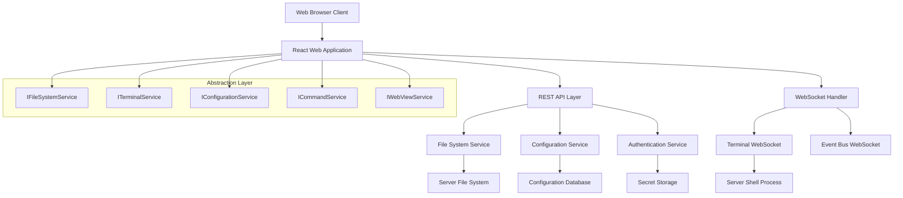

            # Kilo Code VS Code Extension Web Migration Analysis

## Executive Summary

This analysis examines the Kilo Code VS Code extension's dependencies on VS Code APIs and designs a comprehensive abstraction layer for web environment compatibility. The goal is to create a standalone web application at `server:5000` that preserves all functionality while running in a browser.

## Key VS Code Dependencies Identified

### 1. Extension Context & Lifecycle (`src/extension/api.ts`, `src/core/webview/ClineProvider.ts`)
- **ExtensionContext**: Storage, secrets, lifecycle management
- **Command Registration**: `vscode.commands.registerCommand()` 
- **Extension Activation**: Package.json activation events
- **Disposable Pattern**: Resource cleanup when extension closes

### 2. WebView System (ClineProvider.ts:393-524)
- **WebviewViewProvider**: `vscode.WebviewViewProvider` interface
- **Webview Creation**: `vscode.window.createWebviewPanel()`
- **Message Passing**: `webview.postMessage()` and `onDidReceiveMessage()`
- **Content Security Policy**: VS Code webview CSP configuration
- **Resource URIs**: `getUri()` for webview assets

### 3. File System Operations (Throughout codebase)
- **Workspace Access**: `vscode.workspace.workspaceFolders`
- **File Operations**: `vscode.workspace.fs.*` APIs
- **Text Documents**: `vscode.workspace.openTextDocument()`
- **File Watchers**: Workspace file change events
- **Path Resolution**: VS Code URI handling

### 4. Terminal Integration (`src/integrations/terminal/`)
- **Terminal Creation**: `vscode.window.createTerminal()`
- **Terminal Management**: `vscode.window.terminals` access
- **Command Execution**: Shell integration and output capture
- **Terminal Events**: `onDidChangeActiveTerminal`

### 5. Configuration Management (ClineProvider.ts:1654-1822)
- **Workspace Configuration**: `vscode.workspace.getConfiguration()`
- **Global State**: `ExtensionContext.globalState`
- **Secret Storage**: `ExtensionContext.secrets`
- **Settings Persistence**: VS Code settings sync

### 6. UI Integration
- **Command Palette**: Command registration and execution
- **Status Bar**: Status indicators and progress
- **Notifications**: `vscode.window.show*Message()`
- **Input Dialogs**: User input collection

## Web Migration Architecture



## Critical Abstraction Points

### 1. File System Abstraction
**Current VS Code APIs:**
- `vscode.workspace.fs.readFile()`
- `vscode.workspace.fs.writeFile()`
- `vscode.workspace.workspaceFolders`

**Web Implementation:**
```typescript
interface IFileSystemService {
  readFile(path: string): Promise<Uint8Array>
  writeFile(path: string, content: Uint8Array): Promise<void>
  stat(path: string): Promise<FileStat>
  readDirectory(path: string): Promise<[string, FileType][]>
  workspaceFolders: readonly IWorkspaceFolder[]
}
```

### 2. Terminal Service Abstraction
**Current VS Code APIs:**
- `vscode.window.createTerminal()`
- `vscode.window.terminals`
- Terminal command execution

**Web Implementation:**
```typescript
interface ITerminalService {
  createTerminal(name?: string): Promise<ITerminal>
  terminals: ITerminal[]
  onDidChangeActiveTerminal: Event<ITerminal>
}

interface ITerminal {
  sendText(text: string): void
  onDidWriteData: Event<string>
  dispose(): void
}
```

### 3. Configuration Service Abstraction
**Current VS Code APIs:**
- `vscode.workspace.getConfiguration()`
- `ExtensionContext.globalState`
- `ExtensionContext.secrets`

**Web Implementation:**
```typescript
interface IConfigurationService {
  getConfiguration(section?: string): Promise<any>
  updateConfiguration(section: string, value: any): Promise<void>
  globalState: IMemento
  secrets: ISecretStorage
}
```

### 4. WebView Communication Replacement
**Current VS Code APIs:**
- `webview.postMessage()`
- `onDidReceiveMessage()`

**Web Implementation:**
- WebSocket connection for real-time communication
- REST API for configuration and state management
- Server-Sent Events for status updates

## Implementation Strategy

### Phase 1: Core Infrastructure
1. **Express.js Server Setup**: Basic server at port 5000
2. **WebSocket Infrastructure**: Real-time communication
3. **File System API**: REST endpoints for file operations
4. **Configuration Storage**: Database for settings persistence

### Phase 2: Service Implementation
1. **File System Service**: Browser File API + server fallback
2. **Terminal Service**: xterm.js + server-side shell proxy
3. **Configuration Service**: localStorage + server persistence
4. **Command System**: Event-driven command registration

### Phase 3: UI Migration
1. **Extract React Components**: From `webview-ui/` directory
2. **Replace VS Code APIs**: Use abstraction layer
3. **State Management**: Redux/Zustand for complex state
4. **Real-time Updates**: WebSocket integration

### Phase 4: Integration Testing
1. **Feature Parity Testing**: Ensure all functionality works
2. **Performance Optimization**: Web-specific optimizations
3. **Security Hardening**: File access controls
4. **Documentation**: Migration guide and API docs

## Security Considerations

### File System Access
- Sandboxed file operations within project directories
- Permission-based access control
- Prevent directory traversal attacks

### Terminal Execution
- Isolated shell sessions per user
- Command filtering and validation
- Resource usage limits

### Configuration Security
- Encrypted secret storage
- Secure session management
- CORS and CSP policies

## Key Challenges & Solutions

### 1. File System Access Limitations
**Challenge**: Browser file system limitations
**Solution**: Hybrid approach with File System Access API + server-side fallback

### 2. Terminal Integration Complexity
**Challenge**: Web-based terminal emulation
**Solution**: xterm.js frontend + WebSocket to server-side shell

### 3. Real-time Communication
**Challenge**: Replace VS Code message passing
**Solution**: WebSocket for real-time + REST for configuration

### 4. State Synchronization
**Challenge**: Maintaining state consistency
**Solution**: Server-side state store with client-side caching

## Migration Compatibility Matrix

| Feature | VS Code API | Web Implementation | Complexity |
|---------|-------------|-------------------|------------|
| File Operations | `vscode.workspace.fs.*` | File System Access API + Server | Medium |
| Terminal | `vscode.window.createTerminal()` | xterm.js + WebSocket | High |
| Configuration | `vscode.workspace.getConfiguration()` | REST API + localStorage | Low |
| WebView | `vscode.WebviewViewProvider` | Direct DOM + React | Low |
| Commands | `vscode.commands.*` | Event Bus System | Medium |
| Secrets | `ExtensionContext.secrets` | Encrypted Server Storage | Medium |

## Next Steps

1. **Clarify Requirements**: Backend infrastructure preferences
2. **Design Review**: Validate architecture approach
3. **Prototype Development**: Build core abstraction layer
4. **Incremental Migration**: Service-by-service replacement
5. **Testing & Validation**: Ensure feature parity

This analysis provides the foundation for a complete migration strategy that maintains all Kilo Code functionality while enabling web deployment.