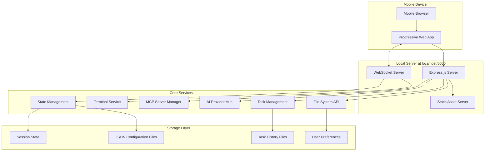

# Kilo Code Web Server Architecture
## Mobile-First Local Development Server

### Executive Summary

This document outlines the complete web server architecture for Kilo Code, designed as a mobile-first local development server running at `server:5000`. The architecture replaces VS Code as the hosting environment while maintaining 100% feature parity, with special emphasis on mobile device accessibility and responsive design.

### Requirements Summary

- **Deployment**: Local development server only
- **Authentication**: Single-user, no authentication required
- **Storage**: File-based JSON (similar to current VS Code extension)
- **Frontend**: New mobile-first React application
- **Target**: Primary focus on mobile devices with desktop support

## System Architecture Overview



## 1. Backend Architecture

### 1.1 Node.js/Express Server Foundation

**Core Server Structure:**
```
server/
├── app.js                 # Main Express application
├── routes/
│   ├── api/               # REST API routes
│   │   ├── files.js       # File operations
│   │   ├── tasks.js       # Task management
│   │   ├── providers.js   # AI provider management
│   │   ├── mcp.js         # MCP server operations
│   │   └── settings.js    # Configuration management
│   └── static.js          # Static asset serving
├── middleware/
│   ├── cors.js            # CORS configuration
│   ├── json-parser.js     # JSON body parsing
│   ├── error-handler.js   # Global error handling
│   └── rate-limiter.js    # Basic rate limiting
├── services/
│   ├── file-system.js     # File system abstraction
│   ├── task-manager.js    # Task lifecycle management
│   ├── ai-providers.js    # AI provider integration
│   ├── mcp-hub.js         # MCP server communication
│   ├── terminal.js        # Terminal service integration
│   └── state-manager.js   # Application state management
└── storage/
    ├── json-store.js      # JSON file storage utility
    ├── config-manager.js  # Configuration file management
    └── session-store.js   # Session state persistence
```

**Express Server Configuration:**
- **Port**: 5000 (configurable via environment)
- **CORS**: Enabled for local development
- **Body Parsing**: JSON with 50MB limit for large files
- **Static Assets**: Serve React build files
- **Error Handling**: Comprehensive error middleware
- **Compression**: gzip compression for mobile bandwidth optimization

### 1.2 WebSocket Server Architecture

**Real-time Communication Features:**
- Task execution progress streaming
- Terminal output real-time display
- AI response streaming
- File system change notifications
- State synchronization across sessions

**WebSocket Message Types:**
```typescript
interface WebSocketMessage {
  type: 'task_progress' | 'terminal_output' | 'ai_response' | 'file_change' | 'state_update'
  id: string
  data: any
  timestamp: number
}
```

**Mobile Optimization:**
- Connection heartbeat for mobile network reliability
- Automatic reconnection with exponential backoff
- Message queuing during disconnections
- Bandwidth-conscious message batching

### 1.3 File System API Design

**REST Endpoints:**
```
GET    /api/files/list                    # List workspace files
GET    /api/files/read/:path              # Read file content
POST   /api/files/write                   # Write file content
POST   /api/files/create                  # Create new file/directory
DELETE /api/files/delete/:path           # Delete file/directory
GET    /api/files/search                 # Search files by content/name
POST   /api/files/move                   # Move/rename files
```

**Mobile Considerations:**
- Chunked file reading for large files
- Progressive loading for directory listings
- Thumbnail generation for image files
- Compressed response formats

### 1.4 Session Management

**File-Based State Persistence:**
```
~/.kilo-code/
├── config/
│   ├── user-preferences.json
│   ├── ai-providers.json
│   └── workspace-settings.json
├── sessions/
│   └── current-session.json
├── tasks/
│   ├── task-{uuid}/
│   │   ├── conversation.json
│   │   ├── ui-messages.json
│   │   └── metadata.json
└── mcp/
    └── servers.json
```

**Session Features:**
- Automatic state persistence every 30 seconds
- Session recovery on page reload
- Task history preservation
- Workspace state restoration

## 2. Frontend Architecture

### 2.1 Mobile-First React Application

**Technology Stack:**
- **Framework**: React 18 with hooks
- **State Management**: Zustand (lightweight alternative to Redux)
- **Styling**: Tailwind CSS with mobile-first breakpoints
- **UI Components**: Custom component library optimized for touch
- **Build Tool**: Vite for fast development and optimal mobile bundles
- **PWA**: Service worker for offline capabilities

**Application Structure:**
```
frontend/
├── src/
│   ├── components/
│   │   ├── layout/
│   │   │   ├── MobileHeader.jsx
│   │   │   ├── MobileNavigation.jsx
│   │   │   ├── TabletSidebar.jsx
│   │   │   └── DesktopLayout.jsx
│   │   ├── chat/
│   │   │   ├── MobileChatInterface.jsx
│   │   │   ├── TouchOptimizedInput.jsx
│   │   │   ├── MessageBubbles.jsx
│   │   │   └── VoiceInputButton.jsx
│   │   ├── files/
│   │   │   ├── MobileFileExplorer.jsx
│   │   │   ├── TouchFileTree.jsx
│   │   │   ├── SwipeActions.jsx
│   │   │   └── FilePreview.jsx
│   │   ├── terminal/
│   │   │   ├── MobileTerminal.jsx
│   │   │   ├── TouchKeyboard.jsx
│   │   │   └── TerminalGestures.jsx
│   │   ├── settings/
│   │   │   ├── MobileSettings.jsx
│   │   │   ├── ProviderSetup.jsx
│   │   │   └── TouchFriendlyForms.jsx
│   │   └── common/
│   │       ├── TouchButton.jsx
│   │       ├── SwipeableModal.jsx
│   │       ├── LoadingSpinner.jsx
│   │       └── ErrorBoundary.jsx
│   ├── hooks/
│   │   ├── useWebSocket.js
│   │   ├── useFileSystem.js
│   │   ├── useTaskManager.js
│   │   ├── useTouchGestures.js
│   │   └── useResponsive.js
│   ├── stores/
│   │   ├── app-store.js          # Global application state
│   │   ├── task-store.js         # Task management state
│   │   ├── file-store.js         # File system state
│   │   └── settings-store.js     # User preferences
│   ├── services/
│   │   ├── api-client.js         # REST API client
│   │   ├── websocket-client.js   # WebSocket client
│   │   ├── file-service.js       # File operations
│   │   └── offline-service.js    # PWA offline capabilities
│   ├── utils/
│   │   ├── mobile-utils.js       # Mobile-specific utilities
│   │   ├── touch-handlers.js     # Touch gesture handlers
│   │   ├── responsive-utils.js   # Responsive design utilities
│   │   └── performance-utils.js  # Mobile performance optimization
│   └── styles/
│       ├── mobile.css           # Mobile-specific styles
│       ├── tablet.css           # Tablet-specific styles
│       ├── desktop.css          # Desktop-specific styles
│       └── touch.css            # Touch interaction styles
```

### 2.2 Mobile-Responsive Design System

**Breakpoint Strategy:**
```css
/* Mobile First Approach */
.container {
  /* Mobile: 320px+ */
  padding: 1rem;
  
  /* Tablet: 768px+ */
  @media (min-width: 768px) {
    padding: 2rem;
    display: grid;
    grid-template-columns: 250px 1fr;
  }
  
  /* Desktop: 1024px+ */
  @media (min-width: 1024px) {
    grid-template-columns: 300px 1fr 250px;
  }
}
```

**Touch-Optimized Interface Elements:**
- Minimum 44px touch targets
- Swipe gestures for navigation
- Pull-to-refresh functionality
- Touch-friendly form controls
- Haptic feedback support
- Voice input capabilities

### 2.3 Progressive Web App (PWA) Features

**Service Worker Capabilities:**
- Offline file caching
- Background sync for task updates
- Push notifications for task completion
- App shell caching for instant loading

**PWA Manifest:**
```json
{
  "name": "Kilo Code Mobile",
  "short_name": "KiloCode",
  "start_url": "/",
  "display": "standalone",
  "theme_color": "#1a1a1a",
  "background_color": "#ffffff",
  "icons": [
    {
      "src": "/icons/icon-192.png",
      "sizes": "192x192",
      "type": "image/png"
    }
  ]
}
```

## 3. Communication Protocols

### 3.1 REST API Specification

**Base URL**: `http://localhost:5000/api`

**Core Endpoints:**

**File Operations:**
```
GET    /files/list?path={path}&limit={limit}&offset={offset}
POST   /files/read { path: string, encoding?: string }
POST   /files/write { path: string, content: string, encoding?: string }
POST   /files/create { path: string, type: 'file' | 'directory' }
DELETE /files/delete { path: string, recursive?: boolean }
GET    /files/search?query={query}&type={type}&limit={limit}
```

**Task Management:**
```
POST   /tasks/create { prompt: string, images?: string[], mode?: string }
GET    /tasks/list?status={status}&limit={limit}&offset={offset}
GET    /tasks/{id}
POST   /tasks/{id}/cancel
POST   /tasks/{id}/resume
DELETE /tasks/{id}
```

**AI Provider Management:**
```
GET    /providers/list
POST   /providers/configure { provider: string, config: object }
POST   /providers/test { provider: string }
GET    /providers/{provider}/models
```

**Mobile-Specific Optimizations:**
- Pagination for all list endpoints
- Compressed JSON responses
- Conditional requests with ETags
- Request/response caching headers

### 3.2 WebSocket Message Protocol

**Connection Management:**
```typescript
// Client to Server
interface ClientMessage {
  type: 'subscribe' | 'unsubscribe' | 'ping'
  channel: string
  data?: any
}

// Server to Client
interface ServerMessage {
  type: 'task_update' | 'terminal_output' | 'file_change' | 'ai_response'
  channel: string
  data: any
  timestamp: number
}
```

**Channel Subscriptions:**
- `task:{taskId}` - Task execution updates
- `terminal:{sessionId}` - Terminal output stream
- `files:{workspacePath}` - File system changes
- `system` - System-wide notifications

## 4. System Integration

### 4.1 Terminal Service Integration

**xterm.js Mobile Adaptation:**
```typescript
// Mobile Terminal Configuration
const terminalConfig = {
  fontSize: 14,
  fontFamily: 'Menlo, Monaco, monospace',
  theme: {
    background: '#1a1a1a',
    foreground: '#ffffff'
  },
  // Mobile-specific settings
  scrollback: 1000,
  cursorBlink: true,
  allowTransparency: false,
  rendererType: 'dom' // Better mobile performance
}
```

**Touch Optimizations:**
- Virtual keyboard integration
- Touch-to-focus behavior
- Swipe scrolling support
- Copy/paste gesture handling
- Zoom support for better readability

### 4.2 AI Provider Connection Architecture

**Provider Abstraction Layer:**
```typescript
interface AIProvider {
  name: string
  configure(config: ProviderConfig): Promise<void>
  sendMessage(message: string, context: Context): AsyncIterator<string>
  getModels(): Promise<Model[]>
  testConnection(): Promise<boolean>
}
```

**Mobile Network Considerations:**
- Connection retry logic with exponential backoff
- Request timeout optimization for mobile networks
- Response streaming with mobile-friendly chunk sizes
- Offline queue for requests when network is unavailable

### 4.3 MCP Server Communication

**Local MCP Server Management:**
- Server discovery and configuration
- Status monitoring and health checks
- Tool execution with mobile UI feedback
- Resource access with permission management

**Mobile Adaptations:**
- Reduced resource consumption
- Battery-efficient polling
- Network-aware communication patterns

## 5. Storage Architecture

### 5.1 File-Based Storage Structure

**Configuration Storage:**
```
~/.kilo-code/
├── config/
│   ├── user-preferences.json      # UI preferences, themes, settings
│   ├── ai-providers.json          # Provider configurations
│   ├── workspace-settings.json    # Workspace-specific settings
│   └── mobile-settings.json       # Mobile-specific preferences
├── sessions/
│   ├── current-session.json       # Active session state
│   └── session-history.json       # Previous sessions
├── tasks/
│   ├── {taskId}/
│   │   ├── conversation.json      # AI conversation history
│   │   ├── ui-messages.json       # UI-specific messages
│   │   ├── metadata.json          # Task metadata
│   │   └── attachments/           # Task-related files
└── cache/
    ├── file-thumbnails/           # Mobile file previews
    ├── response-cache/            # Cached AI responses
    └── offline-queue/             # Queued requests for offline mode
```

### 5.2 State Management Strategy

**Zustand Store Configuration:**
```typescript
// Global App Store
interface AppState {
  isConnected: boolean
  currentWorkspace: string
  activeTask: string | null
  networkStatus: 'online' | 'offline' | 'slow'
  deviceType: 'mobile' | 'tablet' | 'desktop'
  orientation: 'portrait' | 'landscape'
}

// Task Management Store
interface TaskState {
  tasks: Task[]
  currentTask: Task | null
  taskHistory: TaskHistoryItem[]
  isExecuting: boolean
  executionProgress: number
}
```

## 6. Security Architecture

### 6.1 Local Development Security

**Minimal Security Requirements:**
- CORS configuration for localhost access
- Basic input sanitization
- File system access restrictions
- Rate limiting for API endpoints

**File System Security:**
```typescript
// Restricted file access patterns
const RESTRICTED_PATHS = [
  '/etc/passwd',
  '/etc/shadow',
  '~/.ssh/',
  '/System/',
  '/Windows/System32/'
]

// Path traversal prevention
function sanitizePath(userPath: string): string {
  const normalized = path.normalize(userPath)
  if (normalized.includes('..')) {
    throw new Error('Path traversal not allowed')
  }
  return normalized
}
```

## 7. Performance Optimization

### 7.1 Mobile Performance Strategies

**Frontend Optimizations:**
- Code splitting by route and feature
- Lazy loading of non-critical components
- Image optimization and lazy loading
- Service worker caching strategies
- Bundle size optimization (target: <200KB initial)

**Backend Optimizations:**
- Response compression (gzip/brotli)
- Request caching with appropriate headers
- Database query optimization (for JSON files)
- Memory management for long-running processes

### 7.2 Network Optimization

**Mobile Network Considerations:**
- Request deduplication
- Response caching strategies
- Optimistic UI updates
- Background sync for non-critical operations
- Offline-first approach where possible

## 8. Deployment Architecture

### 8.1 Local Development Setup

**Installation Process:**
```bash
# Install Kilo Code Web Server
npm install -g @kilocode/web-server

# Start server
kilocode-web --port 5000 --workspace ./my-project

# Access via mobile browser
# http://localhost:5000
```

**Development Workflow:**
1. Start local server on port 5000
2. Access via mobile browser or PWA
3. Auto-discovery of workspace files
4. Real-time synchronization with desktop development

### 8.2 Mobile Access Patterns

**Local Network Access:**
- Server accessible via local IP address
- QR code generation for easy mobile connection
- mDNS discovery for seamless connection

**PWA Installation:**
- Add to home screen capability
- Offline functionality
- Native app-like experience

## 9. Migration Strategy

### 9.1 VS Code Feature Parity

**Core Features to Implement:**
1. ✅ File system operations
2. ✅ AI provider integration
3. ✅ Task management and history
4. ✅ Terminal integration
5. ✅ MCP server communication
6. ✅ Settings and preferences
7. ✅ Multi-language support
8. ✅ Theme support

**Mobile-Specific Enhancements:**
1. Touch-optimized interfaces
2. Voice input capabilities
3. Gesture navigation
4. Responsive design system
5. Offline functionality
6. Performance optimization

### 9.2 Implementation Phases

**Phase 1: Core Server (2-3 weeks)**
- Express server setup
- WebSocket implementation
- File system API
- Basic storage layer

**Phase 2: Mobile Frontend (3-4 weeks)**
- React application setup
- Mobile-first responsive design
- Core UI components
- State management implementation

**Phase 3: Feature Integration (2-3 weeks)**
- AI provider integration
- Task management system
- Terminal integration
- MCP server communication

**Phase 4: Mobile Optimization (1-2 weeks)**
- PWA implementation
- Performance optimization
- Touch gesture implementation
- Offline capabilities

**Phase 5: Testing & Polish (1-2 weeks)**
- Mobile device testing
- Performance optimization
- Bug fixes and refinements
- Documentation completion

## 10. Success Metrics

### 10.1 Performance Targets

**Mobile Performance Goals:**
- Initial page load: <3 seconds on 3G
- Time to interactive: <5 seconds on 3G
- Bundle size: <200KB initial, <1MB total
- Offline functionality: 90% of features available

**User Experience Targets:**
- Touch response time: <100ms
- Gesture recognition accuracy: >95%
- Cross-device synchronization: <1 second
- Battery impact: Minimal (efficient WebSocket usage)

### 10.2 Feature Completeness

**VS Code Parity Checklist:**
- [ ] All core file operations
- [ ] Complete AI provider support
- [ ] Full task management capabilities
- [ ] Terminal functionality
- [ ] MCP server integration
- [ ] Settings synchronization
- [ ] Theme and personalization
- [ ] Multi-language support

## Conclusion

This architecture provides a comprehensive foundation for creating a mobile-first Kilo Code web server that maintains full feature parity with the VS Code extension while optimizing for mobile device usage. The design emphasizes performance, usability, and maintainability while leveraging modern web technologies to deliver a native app-like experience on mobile devices.

The phased implementation approach ensures steady progress toward a fully functional mobile development environment, opening up new possibilities for coding and AI assistance on mobile devices.